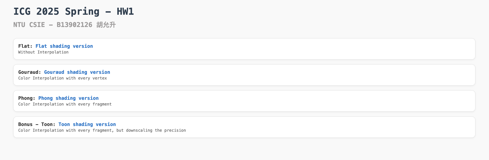
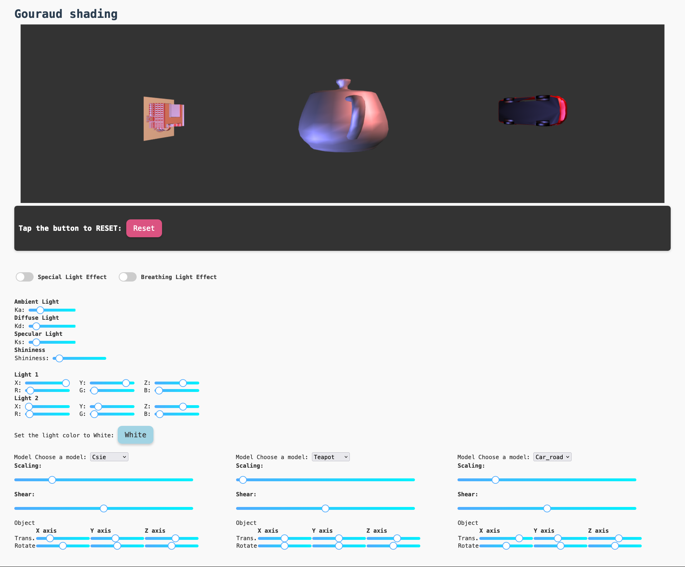

# NTU ICG - Homework 1

Homework 1 for Interactive Computer Graphics (Spring 2025), Dept. of Computer Science and Information Engineering, National Taiwan University.
國立台灣大學資訊工程學系 計算機圖形(CSIE5085)，歐陽明老師授課

---

## 1. Using the content in `index.html` to choose the shader

## 2. Use the manual below the canvas to manipulate the model

## 3. Function implement
- **Tranformation** (Scale, Shear, Rotate, Traslate)
- **Shading** (Phong, Gouraud, Flat, Toon)
- **Light** (Color, Location, Ka, Kd, Ks, Shininess, White)
- **Model Choosing**
- **Reset**

## 4. Additional function 
- **Special Light Effect** Randomly change the color of the model.
- **Breathing Light Effect**: Smoothly change the color of the model.